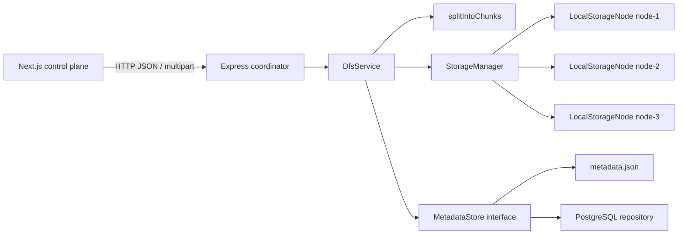

# MiniDFS

MiniDFS is a local distributed-file-system simulation. An Express coordinator accepts a file, splits it into fixed-size chunks, writes each chunk to multiple local storage-node directories, records metadata and SHA-256 checksums, and reconstructs downloads from healthy replicas. A small Next.js control-plane UI exposes node failures, file topology, activity, and manual replication repair.

This document describes the implementation that exists in this repository. It is intentionally explicit about what is simulated and what is not implemented.

## Problem And Scope

The project demonstrates the core control-plane concerns of a distributed file store:

- partitioning a file into independently addressable chunks;
- placing each chunk on multiple nodes;
- tracking the relationship between files, chunks, and replicas;
- tolerating an offline node while another replica is available;
- validating data integrity during reads and repair; and
- restoring the configured replication factor after a simulated failure.

It is a single-process educational system, not a production storage service. The three nodes are directories on the same machine, the coordinator owns all placement decisions, and uploads, downloads, and repairs execute synchronously in the HTTP request process.

## Repository Layout

```text
.
├── Readme.md                         # This document
├── backend/
│   ├── src/index.ts                   # Express app, routes, startup
│   ├── src/config.ts                  # Environment-backed configuration
│   ├── src/services/dfs.service.ts    # Upload, download, status, repair logic
│   ├── src/chunking/chunker.ts        # Fixed-size chunking
│   ├── src/storage/                   # Local node adapters and manager
│   ├── src/repositories/              # Metadata interface and implementations
│   ├── src/types/index.ts             # Shared backend domain types
│   ├── src/utils/checksum.ts          # SHA-256 helper
│   ├── schema.sql                     # PostgreSQL schema for inspection/manual setup
│   ├── data/metadata.json             # Default JSON metadata store
│   └── storage/node-{1,2,3}/          # Local chunk bytes
└── frontend/
	├── app/page.tsx                   # Client control-plane screen
	├── app/globals.css                # UI styling
	└── lib/api.ts, lib/types.ts       # Axios API client and frontend types
```

## Architecture



### Components

| Component | Implementation | Responsibility |
| --- | --- | --- |
| HTTP coordinator | `backend/src/index.ts` | Creates middleware and dependencies, exposes routes, maps known errors to HTTP responses, initializes metadata and storage, and starts the server. |
| DFS service | `backend/src/services/dfs.service.ts` | Owns the domain workflow: placement, replication, download reconstruction, node status, topology, status, events, and repair. |
| Chunker | `backend/src/chunking/chunker.ts` | Produces zero-based chunks of `CHUNK_SIZE`; an empty file becomes one empty chunk. |
| Storage manager | `backend/src/storage/storage-manager.ts` | Creates one `LocalStorageNode` adapter per metadata node and resolves adapters by node ID. |
| Local storage node | `backend/src/storage/local-storage-node.ts` | Maps a chunk ID to a file under `<STORAGE_ROOT>/<node-id>/`, then reads or writes bytes using Node filesystem APIs. |
| Metadata abstraction | `backend/src/repositories/metadata-store.ts` | Keeps the DFS service independent of the metadata backend. |
| JSON repository | `backend/src/repositories/metadata.repository.ts` | Loads and atomically rewrites a complete `MetadataSnapshot` at `METADATA_PATH`. |
| PostgreSQL repository | `backend/src/repositories/postgres-metadata.repository.ts` | Creates the schema at startup, persists normalized records, and maintains an in-memory snapshot for synchronous reads. |
| Frontend API client | `frontend/lib/api.ts` | Calls the backend with Axios and builds download URLs. |
| Frontend screen | `frontend/app/page.tsx` | Loads status, files, and events, uploads files, toggles nodes, triggers repair, and displays topology and download links. |

The backend is the source of truth for placement and metadata. The frontend does not contain storage logic and does not write directly to the filesystem or database.

## End-To-End Data Flows

### Startup

1. `dotenv` loads variables and `config.ts` applies positive-number validation plus defaults.
2. Three default nodes, `node-1` through `node-3`, are created as `ONLINE` with `NODE_CAPACITY` and zero recorded usage.
3. `DATABASE_URL` selects `PostgresMetadataRepository`; without it, `MetadataRepository` uses `METADATA_PATH`.
4. The selected metadata store initializes its records. PostgreSQL creates tables and inserts missing default nodes; JSON loads the snapshot or creates a new one.
5. `StorageManager.initialize()` creates `<STORAGE_ROOT>/node-1`, `/node-2`, and `/node-3` (or the configured node directories).
6. Express listens on `PORT`.

### Upload

`POST /api/files/upload` must contain a multipart field named `file`. Multer uses memory storage, so the complete upload is held in a `Buffer` before DFS processing.

1. `DfsService.upload()` lists `ONLINE` nodes and rejects the request with `503` if fewer than `REPLICATION_FACTOR` are healthy.
2. A file record is created with a UUID, original filename, byte size, MIME type, timestamp, and a chunk count that is filled in after chunking.
3. `splitIntoChunks()` creates chunks in order. The default size is 1 MiB. Each chunk receives an ID such as `chunk-<UUID>` and a SHA-256 checksum.
4. `selectNodes()` chooses distinct online nodes in round-robin-like rotation using an in-memory `placementCursor`. It chooses exactly `REPLICATION_FACTOR` nodes for every chunk.
5. The service writes the same chunk bytes to every selected node, increments each node's `usedSpace`, persists the node record, and emits a creation event.
6. After all bytes are written, the file and all chunk/replica metadata are persisted together through `addFile()`.
7. A file-upload event is recorded and the response returns the `FileRecord` with HTTP `201`.

The metadata commit happens after physical writes. If a later write or metadata operation fails, already-written chunk files can remain without a corresponding complete file record; there is no rollback or cleanup workflow.

### Download

1. `GET /api/files/:id/download` resolves the file or returns `404`.
2. Chunks are loaded by file ID and sorted by `chunkIndex`.
3. For each chunk, the first replica whose metadata node is `ONLINE` is selected.
4. The bytes are read from that node and hashed with SHA-256. A mismatch returns `500`; no alternate replica is attempted after a checksum mismatch.
5. Valid chunk buffers are concatenated in index order, and the response uses the stored MIME type and URL-encoded original filename.
6. A read event is emitted for every chunk.

If no replica for a chunk is online, the request returns `503` and the file is not returned.

### Failure Simulation And Repair

The node status endpoints only change metadata status; they do not stop a process or remove files. An `OFFLINE` node is excluded from new placement and reads, but its bytes remain on disk.

`POST /api/system/repair` scans every chunk:

1. It counts replicas whose metadata nodes are `ONLINE`.
2. While the count is below `REPLICATION_FACTOR`, it reads from the first healthy source replica and verifies its checksum.
3. It selects an online node that is not already listed for the chunk, writes the bytes there, increments that node's usage, and updates the chunk replica list.
4. It emits copy events and finally a summary event when at least one replica was restored.

Repair returns `{ repairedChunks, repairedReplicas }`. If no healthy source exists for a degraded chunk, it returns `503`. If there is no eligible additional online node, the loop stops for that chunk and may leave it under-replicated.

## Metadata And Relationships

The domain types are defined in `backend/src/types/index.ts`:

- `FileRecord`: file identity and presentation metadata. `chunkCount` records the number of chunks.
- `ChunkRecord`: file ownership, zero-based order, byte size, SHA-256 checksum, and `nodeIds` for replicas.
- `StorageNodeRecord`: node identity, `ONLINE`/`OFFLINE` status, configured capacity, and tracked `usedSpace`.
- `ActivityEvent`: UUID, human-readable message, and timestamp.
- `FileTopology`: a file plus chunks whose `nodeIds` are expanded into replica node records.

The logical relationships are:

```text
File 1 ──< Chunk 1 ──< Replica >── 1 StorageNode

System ──< ActivityEvent
```

### JSON mode

`MetadataRepository` stores all four collections in one `MetadataSnapshot`. Every mutation serializes the complete snapshot to `<path>.tmp` and renames it over the target, giving a simple same-filesystem atomic replacement. The repository keeps at most 200 events, returning them newest first. A read/parse failure during initialization is treated as an empty store and can overwrite the configured metadata file on the first persist.

### PostgreSQL mode

`schema.sql` and the embedded schema in `PostgresMetadataRepository` define:

- `storage_nodes`: node state and capacity counters;
- `files`: one row per logical file;
- `chunks`: one row per file chunk with a foreign key to `files` and a unique `(file_id, chunk_index)`;
- `chunk_replicas`: many-to-many chunk/node relationship with a composite primary key;
- `activity_events`: bounded operational event history.

File, chunk, and replica inserts run in one transaction. Node updates, replica-list updates, and event writes are separate operations. PostgreSQL is used for persistence, but reads are served from the repository's in-memory snapshot after startup and local mutations; there is no reload or multi-process synchronization after initialization.

## HTTP API

All API routes are prefixed with `/api`. JSON errors have the shape `{ "error": "message" }`.

| Method and path | Request | Response |
| --- | --- | --- |
| `GET /` | None | `{ "name": "MiniDFS", "status": "running" }` |
| `POST /api/files/upload` | `multipart/form-data`, field `file` | `201` and a `FileRecord` |
| `GET /api/files` | None | `FileRecord[]` |
| `GET /api/files/:id` | Path file ID | `FileTopology`; this is an alias for topology |
| `GET /api/files/:id/topology` | Path file ID | `FileTopology` with each chunk's `replicas` array |
| `GET /api/files/:id/download` | Path file ID | Raw reconstructed bytes; MIME and download headers are set |
| `DELETE /api/files/:id` | Path file ID | `204` after deleting the file metadata and every chunk replica |
| `GET /api/system/status` | None | `{ nodes, totalFiles, totalChunks, totalReplicas, healthyNodes }` |
| `GET /api/system/events` | None | `ActivityEvent[]`, newest first |
| `POST /api/system/repair` | Empty body | `{ repairedChunks, repairedReplicas }` |
| `GET /api/nodes` | None | `StorageNodeRecord[]` |
| `POST /api/nodes/:id/offline` | Path node ID | Updated `StorageNodeRecord` |
| `POST /api/nodes/:id/online` | Path node ID | Updated `StorageNodeRecord` |

Known status codes include `201` for upload, `400` for a missing multipart file, `404` for an unknown file or node, `503` for unsatisfied replication or unavailable data, and `500` for checksum mismatch or unexpected errors. CORS is enabled globally, JSON parsing is enabled, and there is no authentication or authorization middleware.

## Configuration

Configuration is read from `backend/.env` by `backend/src/config.ts`. Positive finite numeric values are accepted; invalid, zero, or negative values use the listed default.

| Variable | Default | Meaning |
| --- | --- | --- |
| `PORT` | `8080` | Backend HTTP port. |
| `CHUNK_SIZE` | `1048576` | Chunk size in bytes; default is 1 MiB. |
| `REPLICATION_FACTOR` | `2` | Number of distinct online nodes targeted per chunk. |
| `NODE_CAPACITY` | `1073741824` | Recorded capacity for each default node; 1 GiB. |
| `STORAGE_ROOT` | `./storage` | Root directory containing node directories. Resolved to an absolute path. |
| `METADATA_PATH` | `./data/metadata.json` | JSON metadata location when PostgreSQL is not selected. |
| `DATABASE_URL` | unset | PostgreSQL connection string. Any non-empty value selects PostgreSQL instead of JSON. |

The frontend reads `NEXT_PUBLIC_API_URL`. Its default is `http://localhost:8080/api`; set it when the backend is hosted elsewhere. The frontend does not proxy API requests.

## Local Development

### Prerequisites

- Node.js compatible with the installed Next.js, TypeScript, and backend dependencies.
- npm.
- PostgreSQL only if persistent relational metadata is desired.

### Backend with JSON metadata

```bash
cd backend
npm install
npm run dev
```

The backend starts on `http://localhost:8080` by default. `npm run dev` uses `tsx watch src/index.ts`. To build and run the compiled backend:

```bash
npm run build
npm start
```

Do not use both JSON and PostgreSQL metadata for the same running instance. Chunk bytes remain under `backend/storage` regardless of metadata backend.

### Backend with PostgreSQL metadata

Create a database, for example:

```bash
createdb minidfs
```

Copy `backend/.env.example` to `backend/.env`, set `DATABASE_URL`, install dependencies, and start the backend. The repository creates the tables automatically at startup. `backend/schema.sql` is available for inspection or manual migration workflows.

### Frontend

In a second terminal:

```bash
cd frontend
npm install
npm run dev
```

Next.js prints the frontend URL, normally `http://localhost:3000`. The UI loads status, files, and events on startup. Select a file to fetch topology, choose a file to upload, use node buttons to simulate outages, and use **Repair replication** to invoke the repair endpoint.

Useful frontend commands are `npm run lint`, `npm run build`, and `npm start` after a production build.

## Example Workflow

```bash
# Check that the coordinator is running
curl http://localhost:8080/

# Upload a file
curl -F "file=@./example.txt" http://localhost:8080/api/files/upload

# Inspect files and topology using the returned id
curl http://localhost:8080/api/files
curl http://localhost:8080/api/files/<file-id>/topology

# Simulate a node failure and inspect health
curl -X POST http://localhost:8080/api/nodes/node-1/offline
curl http://localhost:8080/api/system/status

# Restore replication from an online source
curl -X POST http://localhost:8080/api/system/repair

# Download the reconstructed file
curl -o restored-example.txt http://localhost:8080/api/files/<file-id>/download
```

With the default replication factor of 2, an upload needs at least two online nodes. Taking one replica offline should still permit download if the other replica is online. Taking all replicas for a chunk offline causes that download to fail with `503`.

## Error Handling And Edge Cases

- Missing upload field: `400 A multipart field named file is required`.
- Unknown file or node: `404` with a descriptive error.
- Too few online nodes at upload time: `503`; no placement is attempted.
- All replicas offline for one chunk: `503`; other chunks are not enough to complete the file.
- Corrupt chunk on the selected source: `500 Checksum mismatch ...`; the implementation does not fail over to another replica for that checksum error.
- No healthy source during repair: `503` and repair stops through the request error path.
- Empty upload: represented as one zero-byte chunk, with a valid SHA-256 checksum for an empty buffer.
- Node capacity: displayed and incremented, but never checked during placement or repair. A node can therefore exceed its configured capacity.
- Existing storage bytes: startup creates directories but does not reconcile files on disk with metadata or recalculate usage.
- Failed upload: physical writes precede metadata insertion, so partial/orphaned chunk files are possible.
- Concurrent mutations: there is no locking around placement cursor, node usage, JSON writes, or repair. The service is designed for a single coordinator process.
- Filename header: download uses the stored name after `encodeURIComponent`; this is not a full content-disposition/security policy.
- CORS and access: all routes are open to any caller that can reach the server.

Unexpected errors are logged by the Express error handler and returned as `500 Internal server error`.

## Background Work, Queues, And Retries

There are no background jobs, message queues, worker processes, scheduled repair jobs, retry policies, or dead-letter queues. Upload, download, node-state changes, and repair run inline in the request handler. A failed storage or database operation rejects the request; there is no automatic retry or compensating cleanup. Repair must be triggered manually through the API or frontend.

## Technology Choices And Trade-offs

- **Node.js and TypeScript:** provide an approachable single-process implementation with typed domain records and direct access to filesystem and PostgreSQL APIs. The trade-off is that the current service has no process isolation or distributed coordination.
- **Express:** keeps the HTTP coordinator and error middleware small and explicit. It does not provide authentication, schema validation, or job execution by itself, so those concerns are absent here.
- **Multer memory storage:** makes the upload-to-chunk flow simple and avoids temporary upload files. It also means memory usage grows with the complete request and there is no configured upload-size limit.
- **Local filesystem:** makes three storage nodes visible and easy to inspect on a laptop. The directories are not independent machines or failure domains.
- **SHA-256:** provides a standard deterministic integrity check for each chunk with a compact hexadecimal representation. It is used for detection, not encryption or confidentiality.
- **JSON metadata:** gives a zero-dependency demo mode and an easy-to-read state file. Rewriting one complete snapshot is simple but is not suitable for large data or concurrent writers.
- **PostgreSQL:** adds relational constraints, foreign keys, and a transaction for file/chunk/replica insertion. It is more durable than JSON metadata, but the repository still caches records in memory and does not coordinate multiple application instances.
- **Next.js and React:** provide a compact browser control plane with a client-side data refresh model. The frontend is a visualization and operator surface, not a second implementation of DFS semantics.
- **Axios:** centralizes frontend HTTP calls and response typing with minimal client code.

## Design Decisions And Alternatives

### Coordinator-led placement

The coordinator selects all replicas and stores their IDs in metadata. This makes the behavior easy to explain and inspect, but creates a single control-plane bottleneck and a single source of placement truth. A production design could use a replicated metadata service or consistent hashing with independent node agents.

### Fixed-size chunks

Fixed-size chunking makes offsets, sizing, and repair predictable. Content-defined chunking could reduce rewrite amplification for changing files, but would make placement and metadata more complex.

### Round-robin-like selection

The in-memory placement cursor rotates the starting node and selects distinct online nodes. It does not consider free capacity, current load, rack/zone diversity, or write latency. A scheduler would be needed for those policies.

### Manual repair

Manual repair keeps the simulation observable and easy to demo. A real system would detect under-replication from heartbeats or metadata changes and enqueue idempotent repair tasks.

### Metadata before or after bytes

The current implementation writes bytes first and commits metadata last, reducing the chance of metadata pointing to a missing newly written file. Its cost is orphaned bytes after partial failure. A production system would add a write protocol, cleanup/reconciliation, idempotency keys, and transactional or journaled state transitions.

## Security And Authentication

Authentication and authorization are not implemented. CORS is open, node status can be changed by any caller, uploads have no explicit size or content policy, and download names are derived from stored client input. The system should be treated as a trusted local demonstration only.

Checksums provide integrity detection for stored bytes but do not provide encryption, identity, authorization, or protection against an attacker who can modify both data and metadata.

## Limitations And Known Issues

- All storage nodes share one host and one process; this does not demonstrate network partitions or independent hardware failure.
- The entire upload is buffered in memory and the entire download is concatenated in memory.
- There is no configured maximum file size or request timeout.
- Replication factor must be satisfiable by distinct online nodes, but configured capacity is not enforced.
- A node marked online does not verify that its chunk files actually exist.
- Download selects the first online replica without read repair or retry after an I/O failure.
- Repair is synchronous, can be expensive for many chunks, and has no progress or cancellation API.
- Metadata and storage writes are not one atomic transaction; crash recovery and orphan cleanup are absent.
- The PostgreSQL repository has no connection shutdown path and its read snapshot is not refreshed from other processes.
- Event history is capped at 200 records and is a human-readable log rather than an auditable structured event model.
- There are no automated tests, health probes beyond the basic root response, metrics, tracing, structured logs, or rate limits in the repository.

## Scalability And Future Improvements

The next improvements should follow the failure modes above:

1. Stream uploads and downloads instead of buffering complete files; enforce request and chunk limits.
2. Move node storage behind networked storage-node services with heartbeats and independent failure domains.
3. Add capacity-aware placement, rack/zone awareness, and explicit node admission/discovery.
4. Make writes idempotent and add a journal or state machine that can reconcile metadata and bytes after crashes.
5. Add retries with bounded backoff for transient storage/database errors, plus idempotent repair tasks and a dead-letter path for permanently failing chunks.
6. Run repair asynchronously through a durable queue and expose job status.
7. Replace the in-memory metadata snapshot with transactional queries or a cache with invalidation if multiple coordinators are introduced.
8. Add authentication, authorization, input validation, upload quotas, safe content-disposition handling, audit events, TLS, and rate limiting.
9. Add unit, integration, and failure-injection tests for partial writes, corrupt replicas, unavailable nodes, restarts, and concurrent repair.
10. Add metrics for latency, bytes written/read, replication health, capacity, checksum failures, and repair backlog.

## Interview Summary

The clean explanation is: **the Express coordinator is the control plane; files are split into fixed-size chunks; every chunk is synchronously replicated to distinct online local directories; PostgreSQL or an atomic JSON snapshot stores file/chunk/node/replica metadata; downloads choose an online replica and verify SHA-256; manual repair copies from a healthy source to an eligible online node.**

The most important trade-off to defend is that the implementation favors visibility and low setup cost over production guarantees. It demonstrates placement, replication, integrity checks, and recovery semantics, while intentionally omitting networked nodes, concurrency control, asynchronous jobs, retries, authentication, capacity enforcement, and crash reconciliation.
